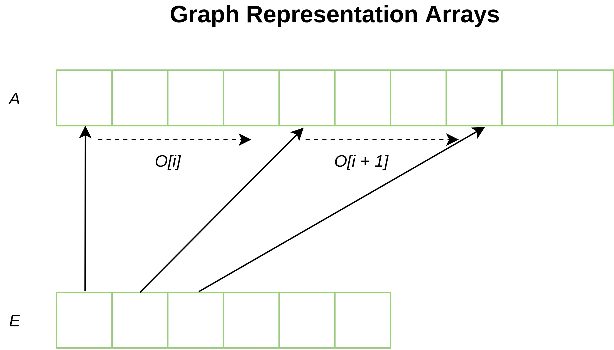
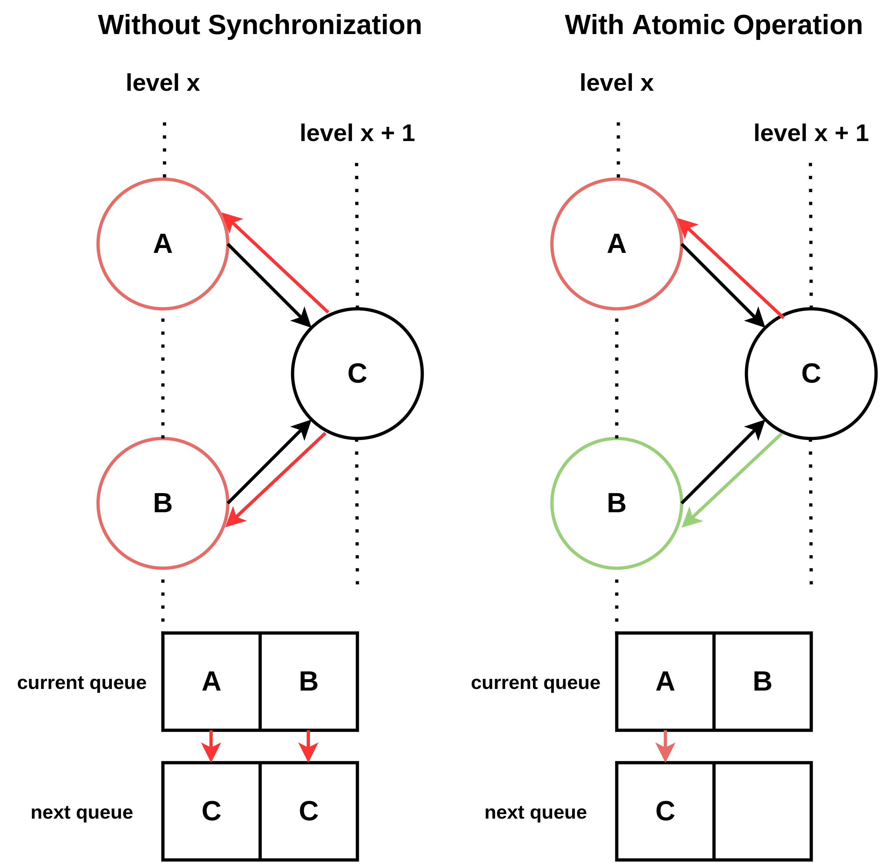
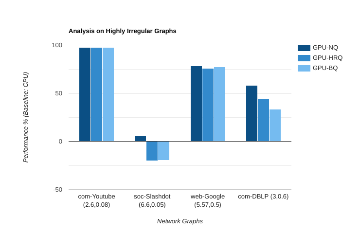
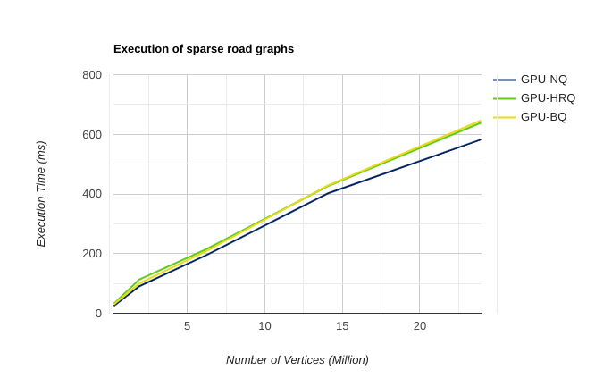

## Background
During the recent decade, the Graphics Processing Unit (GPU) has become an important aspect of computation and not just in the field of Gaming. GPU computing is the use of GPUs to accelerate general-purpose tasks which are executed on the CPU. GPU is used when there are applications which use computer-intensive time-consuming operations.  From user-level abstraction, it is simply an application which runs faster with help of parallel processing. This advantage of having a massive number of cores can help make applications more efficient and seamless.

When it comes to Graph, It is one of the most important data structures which can represent real-world scenarios such as Network Graphs in Routing, Flight Networks, Pathfinding for Navigation systems, etc. Evidently, we are talking about millions of vertices that need to pass information back and forth through their links. These large connections will increase the time in the order of vertices. We can see sequential implementations that run on supercomputers perform well, but have very expensive Hardware. Whereas GPUs are much cheaper when compared to these computers. GPUs are highly programming restrictive due to the nature of their hardware.

This project depicts the use of GPGPU to help improve the performance of the Pathfinding algorithms, Breadth-First Search and Single-Source Shortest Path specifically. I will present GPU implementations of these algorithms along with different approaches taken. Experimental results show that up to 6.52 times speedup is achieved over its CPU counterpart.

## CUDA Programming Model
A general-purpose programming model by Nvidia that leverages the use of GPUs to solve many complex problems in an efficient way than CPU. CUDA comes with a software environment that helps developers to build applications using C/C++. The main challenge is to use an increasing number of cores in GPUs for parallelizing parts of the application. The idea is to distribute the workload among all the cores parallelly by assigning a task to each thread. The model has three main abstractions Grids, Blocks, and Threads at the lowest granularity. Depending on your GPU model, cores, and compute capabilities will vary. These partitions divide the problems into subproblems to be solved independently. You can find out more here. The Nvidia GPUs have SIMT architecture similar to SIMD, where all the threads execute the same instruction set on different data in parallel.

## Graph Representation
A graph _G(V,E)_ can be represented as an Adjacency Matrix as well as an Adjacency List. Here, I have used an adjacency list due to their efficient use of space O(V+E).  This list _A_ can be stored contiguously along with two more arrays,  _E_ which holds all the offsets, and, _O_ which holds the outdegree for a vertex _v_ which means _A[v]to A[v+O[v]]_ holds all the children. There can be an additional weighted array _W_  which is stored contiguously as well.  
<p align="center">  </p>

## Breadth-First Search
### Definition
Given an undirected, unweighted graph _G(V,E)_  and a given source _S_, find the minimum distance from _S_ to each vertex in Gsuch that all the vertices with the same depth must be visited before moving to the next level. Hence it is guaranteed to find the shortest path to a vertex.

### Serial Approach

The BFS Algorithm is,
- Adding S into the queue
- Until all vertices are not visited
   Loop over all the vertices adjacent to the front vertex
   To avoid cycles mark the vertices as visited
   Add them at the back of the queue







## Welcome to GitHub Pages

You can use the [editor on GitHub](https://github.com/abhishek1297/Parallel-Algorithms/edit/gh-pages/index.md) to maintain and preview the content for your website in Markdown files.

Whenever you commit to this repository, GitHub Pages will run [Jekyll](https://jekyllrb.com/) to rebuild the pages in your site, from the content in your Markdown files.

### Markdown

Markdown is a lightweight and easy-to-use syntax for styling your writing. It includes conventions for

```markdown
Syntax highlighted code block

# Summary
## Header 2
### Header 3

- Bulleted
- List

1. Numbered
2. List

**Bold** and _Italic_ and `Code` text

[Link](url) and 
```

| **G** | **V** | **E** | **CPU** | **GPU-N** | **GPU-B** | **GPU-H** |
| --------- | --------- | --------- | --------- | --------- | --------- | --------- |
| New York  | 264,346 | 733,846 | 29.9261 ms | 1.21x | 0.98x | 0.92x |
| California | 1,890,815 | 4,657,742 | 237.658 ms | 2.62x | 2.38x | 2.10x |
| Western USA | 6,262,104 | 15,248,146 | 857.753 ms | 4.38x | 4.09x | 3.97x |
| Central USA | 14,081,816 | 34,292,496 | 2625.37 ms | 6.52x | 6.11x | 6.15x |
| Whole USA | 23,947,347 | 58,333,344 | 3400.58 ms | 5.80x | 5.35x | 5.30x |


For more details see [GitHub Flavored Markdown](https://guides.github.com/features/mastering-markdown/).

### Jekyll Themes

Your Pages site will use the layout and styles from the Jekyll theme you have selected in your [repository settings](https://github.com/abhishek1297/Parallel-Algorithms/settings). The name of this theme is saved in the Jekyll `_config.yml` configuration file.

### Support or Contact

Having trouble with Pages? Check out our [documentation](https://docs.github.com/categories/github-pages-basics/) or [contact support](https://github.com/contact) and we’ll help you sort it out.
