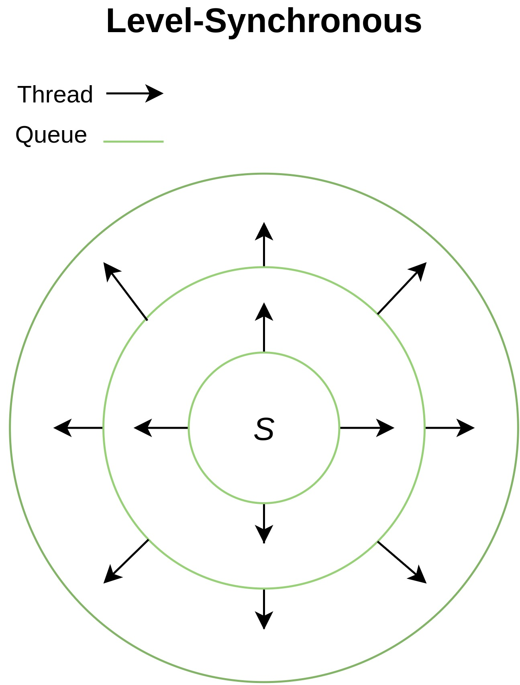
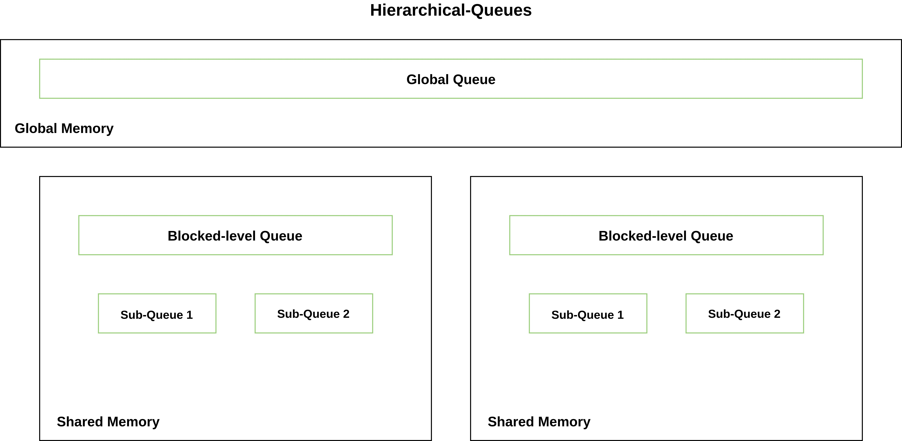

# Background
During the recent decade, the Graphics Processing Unit (GPU) has become an important aspect of computation and not just in the field of Gaming. GPU computing is the use of GPUs to accelerate general-purpose tasks which are executed on the CPU. GPU is used when there are applications which use computer-intensive time-consuming operations.  From user-level abstraction, it is simply an application which runs faster with help of parallel processing. This advantage of having a massive number of cores can help make applications more efficient and seamless.

When it comes to Graph, It is one of the most important data structures which can represent real-world scenarios such as Network Graphs in Routing, Flight Networks, Pathfinding for Navigation systems, etc. Evidently, we are talking about millions of vertices that need to pass information back and forth through their links. These large connections will increase the time in the order of vertices. We can see sequential implementations that run on supercomputers perform well, but have very expensive Hardware. Whereas GPUs are much cheaper when compared to these computers. GPUs are highly programming restrictive due to the nature of their hardware.

This project depicts the use of GPGPU to help improve the performance of the Pathfinding algorithms, Breadth-First Search and Single-Source Shortest Path specifically. I will present GPU implementations of these algorithms along with different approaches taken. Experimental results show that up to 6.52 times speedup is achieved over its CPU counterpart.

# CUDA Programming Model
A general-purpose programming model by Nvidia that leverages the use of GPUs to solve many complex problems in an efficient way than CPU. CUDA comes with a software environment that helps developers to build applications using C/C++. The main challenge is to use an increasing number of cores in GPUs for parallelizing parts of the application. The idea is to distribute the workload among all the cores parallelly by assigning a task to each thread. The model has three main abstractions Grids, Blocks, and Threads at the lowest granularity. Depending on your GPU model, cores, and compute capabilities will vary. These partitions divide the problems into subproblems to be solved independently. You can find out more here. The Nvidia GPUs have SIMT architecture similar to SIMD, where all the threads execute the same instruction set on different data in parallel.

# Graph Representation
A graph _G(V,E)_ can be represented as an Adjacency Matrix as well as an Adjacency List. Here, I have used an adjacency list due to their efficient use of space _O(V+E)_.  This list _A_ can be stored contiguously along with two more arrays,  _E_ which holds all the offsets, and, _O_ which holds the outdegree for a vertex _v_ which means _A[v]to A[v+O[v]]_ holds all the children. There can be an additional weighted array _W_  which is stored contiguously as well.  

  

# Breadth-First Search
## Definition
Given an undirected, unweighted graph _G(V,E)_  and a given source _S_, find the minimum distance from _S_ to each vertex in Gsuch that all the vertices with the same depth must be visited before moving to the next level. Hence it is guaranteed to find the shortest path to a vertex.

## Serial Approach

The BFS Algorithm is,
- Adding _S_ into the queue
- Until all vertices are not visited
  - Loop over all the vertices adjacent to the front vertex
  - To avoid cycles mark the vertices as visited
  - Add them at the back of the queue

The queue ensures level-wise progression. This serial implementation has the time complexity of _O(VE)_. Once the density of the graph increases it really becomes challenging for the CPU execution to finish in optimal time. Note that I have not used extra space to keep track of the visited vertices since the array of distances is sufficient to check whether the vertex is visited or not. Also, I do not store any previous vertices because in a parallel implementation the current vertex may be found via a different path.

## Parallel Approach (Naive)

This approach is somewhat similar to the serial implementation. While parallelizing BFS, the only way to traverse is level-wise. So as suggested in [B4] perform level-synchronous BFS where the current queue represents the current level. Instead of only visiting the front vertex of the queue, distribute each vertex to a thread to fill the next level queue in parallel. Even if the current vertex may have different paths, the level-synchronous approach makes sure that the overwrites by different threads will always be the same.

  

### Possible Problems
- At a bare minimum, GPU requires around ~300 clock cycles to access global memory. It is always ideal to perform memory coalescing, where all the threads access the memory at the same time. It is important to maximize the bandwidth to global memory.
- Since performing level-synchronization is necessary, All the threads need to update the same queue, which brings race conditions between them that could lead to inconsistencies.
- Parallelizing the outermost loop is difficult because the algorithm goes level by level. Therefore, the CUDA kernel must be launched for each new level. This incurs the cost of time consumed for data transfer between CPU and GPU.
- The graph density as well as regularness also play a huge role. It is possible that a graph may not utilize maximum GPU throughput i.e launching less number of threads at every level.
- Highly irregular access to global memory will slow down the performance.
- The load imbalance between threads is difficult to avoid i.e the outdegrees varying drastically at the same time.

### Blocked Queue Approach

CUDA provides an L2 cache for each block where only threads running in that block can access this shared memory. It is located on-chip so the access times are reduced due to high bandwidth and low latency. Depending on the number of memory allocated between multiple blocks execution times may vary due to resource use limitations of the GPU. Regardless, this shared memory could be used to maintain a block-level queue to ensure threads will only write to the global queue if and only if the block-level queue is full. This will help avoid collisions at the global queue. Once all threads explore their corresponding adjacent vertices, The block-level queue could coalesce the to the global memory if the sufficient number of threads are launched.

### Hierarchical Queue Approach
Hierarchical Queue Approach
As shown in [B1] it is possible to specialize the queue by adding another level for warps. Thus, avoiding collisions at the block-level queue as well. According to the indices of threads, each one is mapped to its respective sub-queue. The authors of the paper have implemented it such that they copy these sub-queues to the block-level queue. It seems unreasonable because both blocked-level and sub-queues reside inside shared memory. I have skipped copying to block-level and directly coalesced to global memory. Similar to the previous approach, when the sub-queue becomes full, the thread will write to the global queue.

  

| **G** | **V** | **E** | **CPU** | **GPU-N** | **GPU-B** | **GPU-H** |
| --------- | --------- | --------- | --------- | --------- | --------- | --------- |
| New York  | 264,346 | 733,846 | 29.9261 ms | 1.21x | 0.98x | 0.92x |
| California | 1,890,815 | 4,657,742 | 237.658 ms | 2.62x | 2.38x | 2.10x |
| Western USA | 6,262,104 | 15,248,146 | 857.753 ms | 4.38x | 4.09x | 3.97x |
| Central USA | 14,081,816 | 34,292,496 | 2625.37 ms | 6.52x | 6.11x | 6.15x |
| Whole USA | 23,947,347 | 58,333,344 | 3400.58 ms | 5.80x | 5.35x | 5.30x |

Table shows the speed up against CPU execution over real-world sparse road graphs from 9th DIMACS shortest path Datasets of USA roads.

# Single-Source Shortest Path
## Definition
The weighted, undirected graph _G(V,E,W)_ and a source vertex _S_, find the shortest path to all the vertices from _S_ such that the distance between any two vertices _(u,v)_ should be minimum of all the paths from _u_ to _v_.

## Serial Approach
The Dijkstra’s Algorithm is,
- Set all the distances to infinity
- Add _S_ to the queue.
- Until all vertices are not visited
  - Pick a vertex which is closer to the current vertex from the queue
  - Loop over all the adjacent vertices
  - If the adjacent vertex has been visited then if the current distance is smaller update distance to vertex to the current distance.
  - Otherwise, add them at the back of the queue.

Now, this queue can be a priority queue. Thus, we can extract the minimum weighted edge in constant time. I avoid the usage of the priority queue because it is maintained as a binary heap under the hood. Therefore, the insertion and deletion require _O(log n)_ which in large arrays could make the performance really slow at least in my case. It is better to perform insertions in constant time. So, instead, I sort the array at each iteration using STL’s sort method which uses Intro sort Algorithm which does hybrid sorting using Quicksort, Heapsort, and, Insertion sort. So this Dijkstra’s has a total running time of _O(VE+Vlog V)_. A handicap for the CPU would be to use a Fibonacci heap where insertion and minimum extraction takes _O(1)_. But I have not explored this because there won’t be much of a performance increase when compared with the parallel approach.

## Parallel Approach

BFS and Dijkstra’s hold very similar approaches except that we need to extract minimum value from the queue in case of Dijkstra’s. It was very easy to convert the Parallel BFS approach into finding the shortest path. There is no need for sorting or extracting the minimum value when you consider all of the vertices in the current queue are executed in parallel. Although, it is important to reflect the changes accordingly when you revisit a vertex via the shortest path. But the essence or the gist remains intact between both parallel approaches. I have implemented this algorithm using Hierarchical-queue approach.

# Attempted Optimizations
## Atomic Operations
To avoid inconsistencies at the global queue as well as the local queue(s). CUDA threads could make use of atomic operations to correctly fill the queues without overwriting at the same location. These atomic operations require an address at which the thread will make its manipulations. Thus, when calling these functions, threads will have exclusive access at that memory location. But the access becomes serialized and also affects the performance.

  

## Shared Memory
- The shared memory in my GPU has 32 banks. Similarly, I have created a total of 32 queues of length 4 in Hierarchical-queue approach. In a way, it perfectly matches with all the banks. In GPUs with CC 6.1, the bank conflict does not occur at the warp level even if two threads from the same warp map to the same bank. This access will be parallel.
- This approach does reduce collisions. But the naive approach has an advantage of simplicity i.e threads in naive implementation will not have much of divergence since each thread is only checking whether the current vertex is visited or not. If not, then write to global memory. Additionally, in the shared memory approaches, there are at most two writes, firstly to the lower queues and then the global queue. Altogether, These aspects deteriorate the performance by 6-8% compared to the naive BFS as shown in the graph below. 

  

The graphs shown above have the average outdegree between 2-3. Therefore, the execution time is directly proportional to the number of vertices in regular or near-regular graphs.
- Between blocked-queue and hierarchical-queue, the latter performs well on graphs with higher clustering coefficient. For smaller graphs, if we consider the thread divergence, both approaches share a similarity in their exploration process. But the conflict at the Hierarchical-queue is reduced. So, the reason why hierarchical-queue is slower for smaller graphs is, while loading the shared queues to the global queue will take more time because of more calculations required to map 2D addresses to 1D addresses.

  

- The above graph was calculated on Network Graphs (Average Degree, Clustering Coefficient)of Google, Youtube, etc. Different clustering coefficient and the unevenly distributed outdegree at each vertex will reduce the performance. The [D1] suggested approach will be better here. But this high variance of outdegree should be considered in Network Graphs where each vertex represents a user and its connections.

## Kernel Launch and Dynamic Parallelism 
- CUDA provides a way to call the kernel within a kernel. This is called Dynamic Parallelism (DP). By calling the kernel recursively, we could maximize the throughput of the GPU by launching unused parts of it.
- Remember, since both algorithms require a level-synchronous approach. If the GPU is executing multiple blocks, then we must ensure that changes made by all of the blocks to the global queue must take place before calling the next kernel recursively.
- CUDA API called cooperative groups provides synchronization options at different granularities. In the DP solution, grid synchronization is needed to make sure all the blocks have executed completely before moving further.
- Unfortunately, this cooperative groups API does not permit the usage of DP. And there is no workaround for inter-block synchronization.
- I also moved the CPU code of the outer loop hoping to avoid data transfer latencies. But this approach was not able to achieve a significant performance increase. My guess would be the kernel launch overhead by a single thread is reducing or at least reaching the same performance as that of the kernel launch from the CPU.
- [D1] describes the implementation of using two kernels where the second kernel will be used for exploration of the adjacent vertices. But the graph datasets I am working with have the average out degrees around 5-10 vertices. Evidently, GPU does not perform well even compared with its CPU counterpart because the cost of the kernel prologue outweighs the parallelism it achieves.

## Read-only caches
- CUDA texture memory(L2) is an on-chip global memory that is aggressively cached for read-only access. There is another read-only constant memory(L2).
- There is only ~64 KB of constant memory. So there is no way it can hold a large array.
- This is where texture memory comes into play. Texture memory exhibits spatial locality meaning nearby threads will read nearby addresses of global memory.
- Unfortunately for Pathfinding algorithms with large arrays, spatial locality does not provide much performance increase. I have attempted reading the current queue array as well as offsets array by binding them to a texture reference. In some cases, the performance decreased by 11% and some cases showed doubled execution times. My assumption is, Multiple threads will attempt to flush texture memory according to their needs and increase the rate of cache misses (Unconfirmed).

## Prefix-Sum
To avoid the usage of atomic operations when calculating the current position for that thread. It is possible to compute the global queue offsets for each thread based on the prefix-sum of their outdegrees. This way threads will not wait for other threads while filling the next queue. So computing a prefix-sum for the current queue would be required at each iteration of the outer loop. Thrust library provides predefined implementations of these algorithms. But would this not incur additional cost even if we compute it parallelly with the help of the GPU? Although, it could be possible to store all the prefix-sums at each iteration. We need to know which vertices will be inside the current queue for every iteration before the main execution. But this seems unreasonable considering the algorithm would not perform well on unknown graphs. But I have not explored this.

# Other Algorithms
## DFS
- DFS is asynchronous meaning at a single vertex the search will continue until all of its children are relaxed. In most of the cases, the outdegrees are not unreasonably large.
Unlike BFS which launches threads at each level where the queue is much larger, DFS will never utilize the GPU’s full capability. For the most part, it will make multiple calls with only fewer threads at the mercy of outdegree at each vertex.
- DFS follows the idea of Backtracking which requires a data structure like Stack. The very idea of the parallelizing stack is difficult since both insertion and extraction occur at the same end.

## A* Search
- It is possible to implement this idea because the SSSP could be expanded to make it work like A* by only proceeding further based on heuristics at the current vertex.
- Now the graphs that I use, Do not provide heuristics for each value which makes sense because the target vertex is needed to approximate heuristic values.
- One possible solution could be to take the target vertex and apply parallel SSSP to all the vertices of the graph to obtain distances. I do not find this solution as an optimal one.
- A* is also used in grid-like structures such as mazes. In this case, it is possible to compute the heuristic at runtime using functions such as Manhattan Distance, Euclidean Distance, etc. Parallelizing this approach is not worth the trouble because even considering diagonal paths, at most 8 threads will be launched at each cell. And as mentioned earlier, GPU always works well with heavier loads. We could parallelize this over CPU cores. But this is beyond the scope of this project.

# Environment
All computations were done using my local machine with Intel i5-7300HQ CPU @ 2.50GHz with 8 GB RAM and 4 cores. The GPU used is Nvidia GeForce GTX 1050 mobile @ 1.49GHz with 4 GB RAM @ 3.5GHz, and 640 CUDA cores.

# Closure
I have shown that GPGPU usage can be used to achieve high performance on Graph Algorithms. I have provided my opinions on pre-existing approaches as well as shown the performance gaps between them. Granted that it is difficult to optimize these algorithms due to nature or uncertainty of the graph itself, be that as is may, substantially great speed-ups were obtained and with some fine-tuning we could keep increasing them marginally.

# References

[B1]  _Lijuan Luo, Martin Wong, Wen-mei Hwu, “An Effective GPU Implementation of Breadth-First Search”_

[B2] _Duane Merrill, Micheal Garland, Andrew Grimshaw, “Scalable GPU Graph Traversal”_
 
[B3] _Rudolf Berrendorf and, Matthias Makulla, “Level-Synchronous Parallel Breadth-First Search Algorithms For Multicore and Multiprocessor Systems”_

[B4] _Pawan Harish, and P. J. Narayanan, “Accelerating large graph algorithms on the GPU using CUDA”_

[D1] _Peter Zhang, John Matty, Eric Holk, Marcin Zalewski, Jonathan Chu, Samantha Misurda, Scott McMillan, Andrew Lumsdaine, “Dynamic Parallelism for Simple and Efficient GPU Graph Algorithms”_

[D2] _Pedro J. Martín, Roberto Torres, and Antonio Gavilanes, “CUDA Solutions for the SSSP Problem”_

[D3] _Michael Kainer, Jesper Larsson Träff, “More Parallelism in Dijkstra’s Single-Source Shortest Path Algorithm”_
